# CampusBuzz

A full-stack college event management system developed as a collaborative academic project using **PHP, MySQL, HTML5, CSS3, and JavaScript**. CampusBuzz streamlines college event management through QR code-based ticket generation, attendance verification, role-based authentication, and automated email notifications.

---

## 📖 Overview

CampusBuzz provides a centralized platform for students and administrators to manage college events efficiently. Students can browse and register for events, receive QR code tickets via email, and verify attendance using QR-based verification. Administrators can create and manage events, monitor registrations, and track attendance through a dedicated dashboard.

---

## ✨ Features

* 👤 User Registration & Login
* 🔐 Role-Based Authentication (Admin & User)
* 📅 Event Creation and Management
* 📝 Event Registration
* 🎫 QR Code Ticket Generation
* ✅ QR Code-Based Attendance Verification
* 📧 Automated Email Notifications using PHPMailer
* 📊 Admin Dashboard
* 👥 User Dashboard
* 📂 Event & User Management
* 🗄️ MySQL Database Integration

---

## 🛠️ Technologies Used

* PHP
* MySQL
* HTML5
* CSS3
* JavaScript
* XAMPP
* PHPMailer
* PHP QR Code Library

---

## 🗃️ Database

The project uses a MySQL database to manage:

* User Accounts
* Event Details
* Event Registrations
* Attendance Records

Import the **campusbuzz.sql** file into phpMyAdmin before running the project.

---

## 🚀 Installation

1. Install XAMPP.
2. Start Apache and MySQL.
3. Import the **campusbuzz.sql** database into phpMyAdmin.
4. Copy the project folder into the **htdocs** directory.
5. Configure the database connection if required.
6. Open your browser and visit:

```text
http://localhost/CampusBuzz
```

---

## 📸 Screenshots

| Home Page                     | User Dashboard                     |
| ----------------------------- | ---------------------------------- |
| 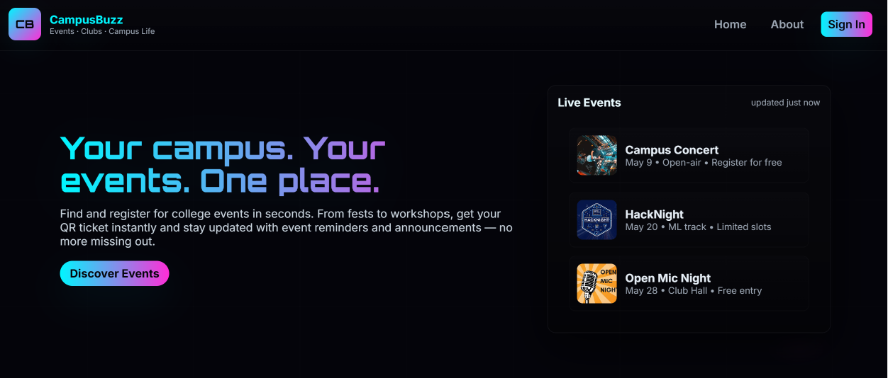 | 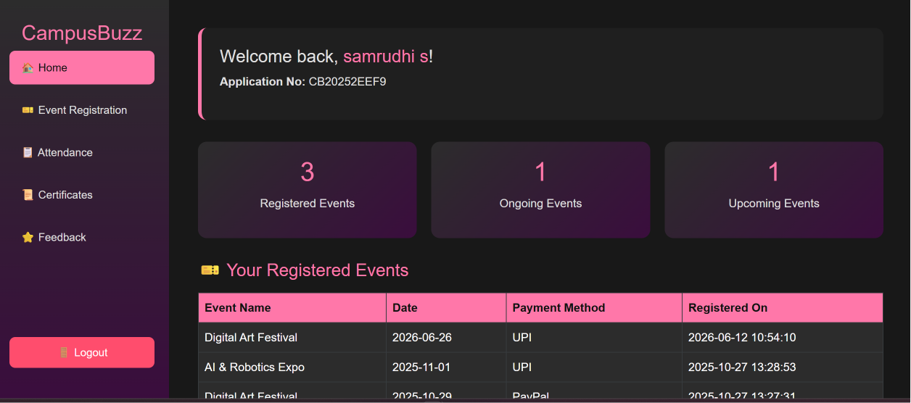 |

| Admin Dashboard                     | Admin Login                     |
| ----------------------------------- | ------------------------------- |
| 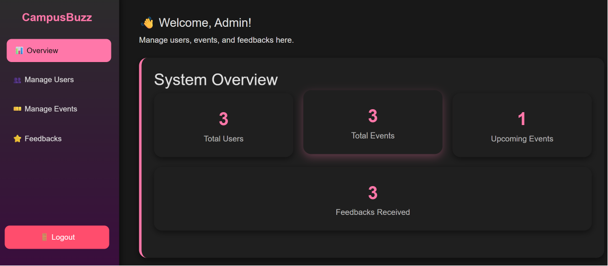 | 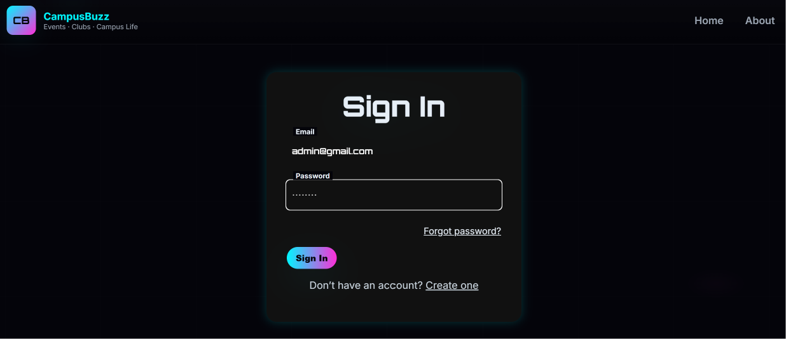 |

| Events Page                        | Event Preview                    |
| ---------------------------------- | -------------------------------- |
| 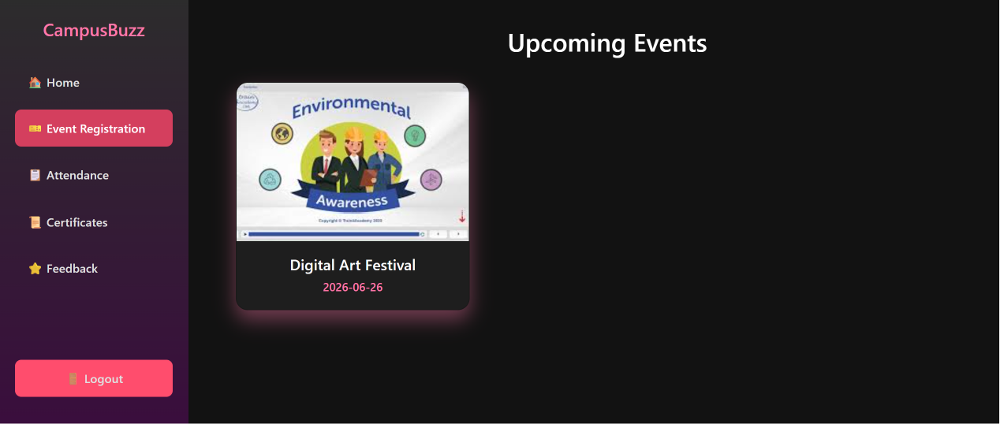 | 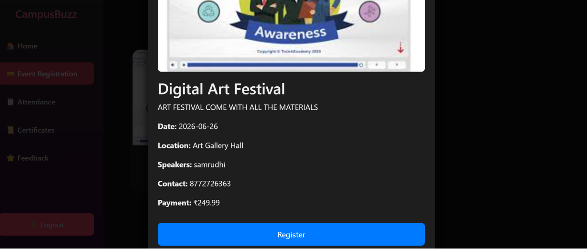 |

| Register Event                     | Upload Event                     |
| ---------------------------------- | -------------------------------- |
| 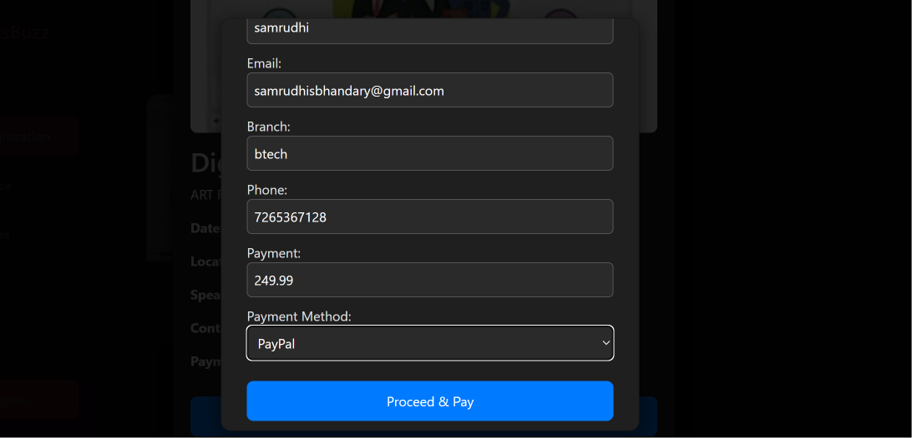 | 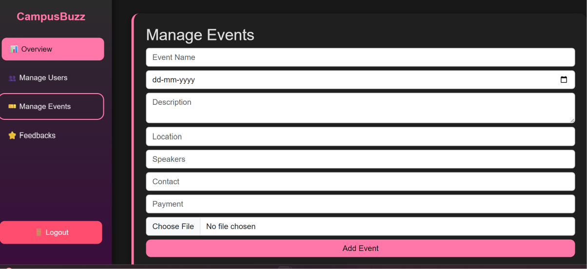 |

| Attendance (Admin)                        | Attendance Report (Student)                        |
| ----------------------------------------- | -------------------------------------------------- |
| 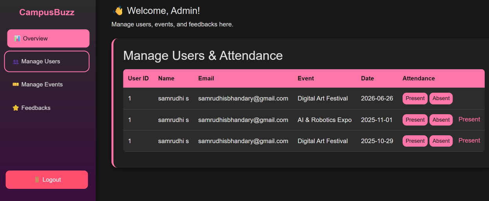 | 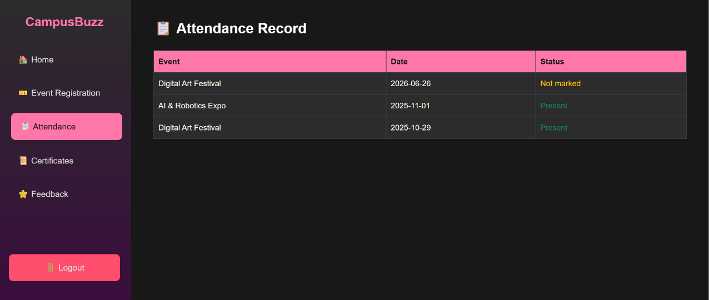 |

| QR Ticket                   | Admin Verification            |
| --------------------------- | ----------------------------- |
|  | 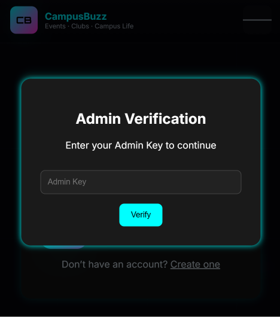 |

| Feedback                      | Feedback Reviews                    |
| ----------------------------- | ----------------------------------- |
| 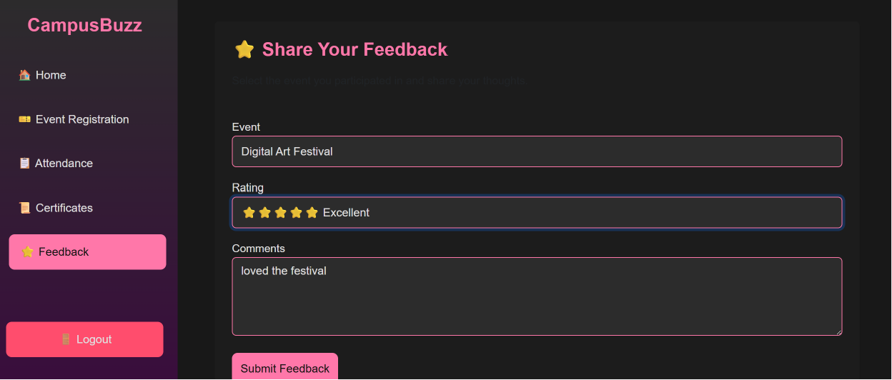 | 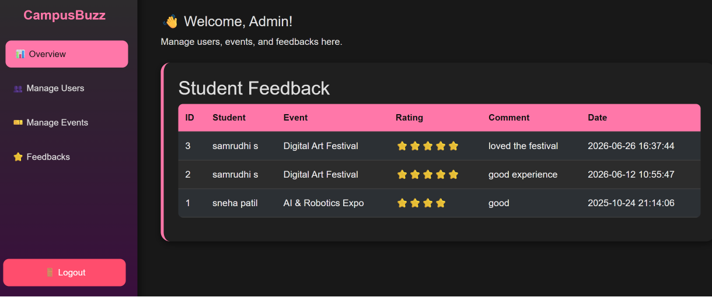 |

| Gallery                      | About Us                     |
| ---------------------------- | ---------------------------- |
| 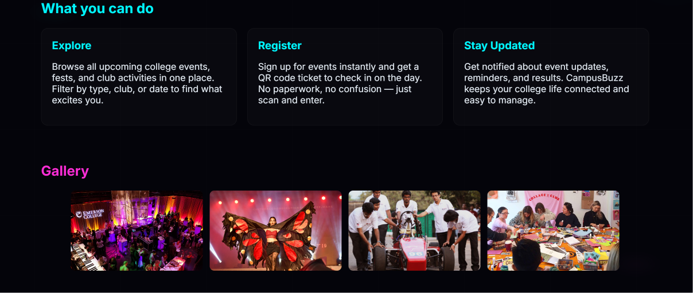 | 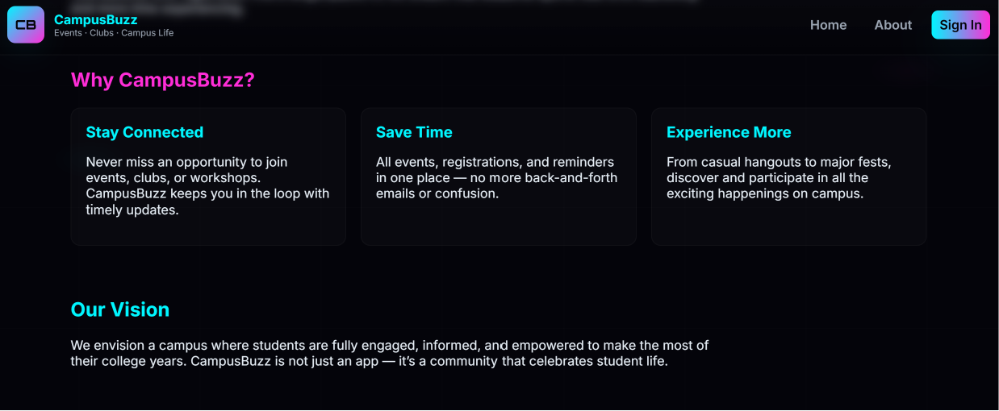 |

| Certificates                      | Certificate Preview                 |
| --------------------------------- | ----------------------------------- |
| 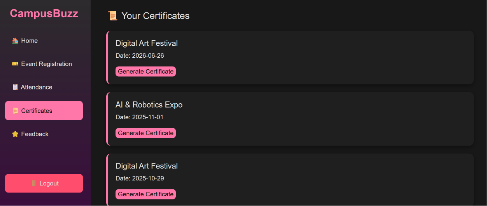 | 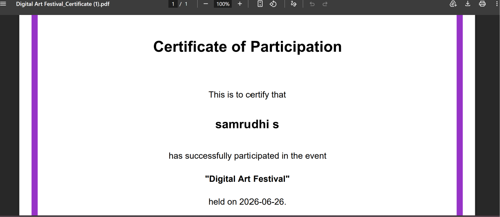 |

| Responsive Design                  |
| ---------------------------------- |
| 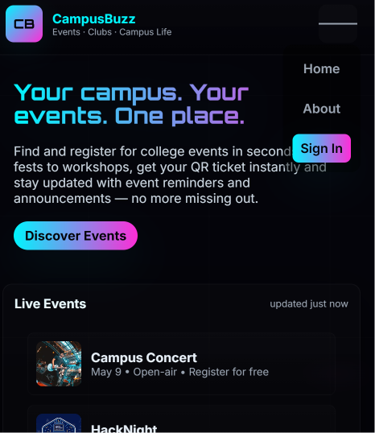 |

---

## 🌱 Future Enhancements

* Event approval workflow
* Event analytics and reporting
* Calendar integration
* Enhanced mobile responsiveness
* Multi-college event management support

---

## 👥 Team

Developed as a collaborative academic project by a team of MCA students at **Manipal Institute of Technology**.

---

## 👩‍💻 My Contributions

* Designed responsive user interface modules.
* Implemented role-based login authentication.
* Developed QR code-based attendance verification.
* Integrated MySQL database operations.
* Contributed to backend development using PHP.

---

## 📄 License

This project is intended for academic and learning purposes.
